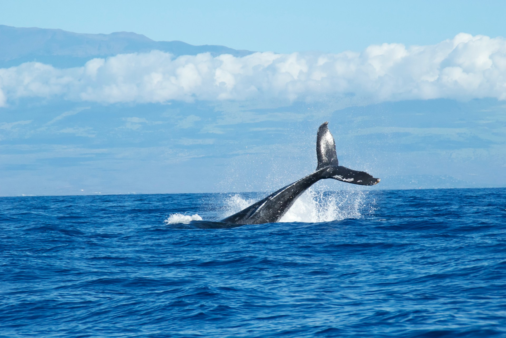
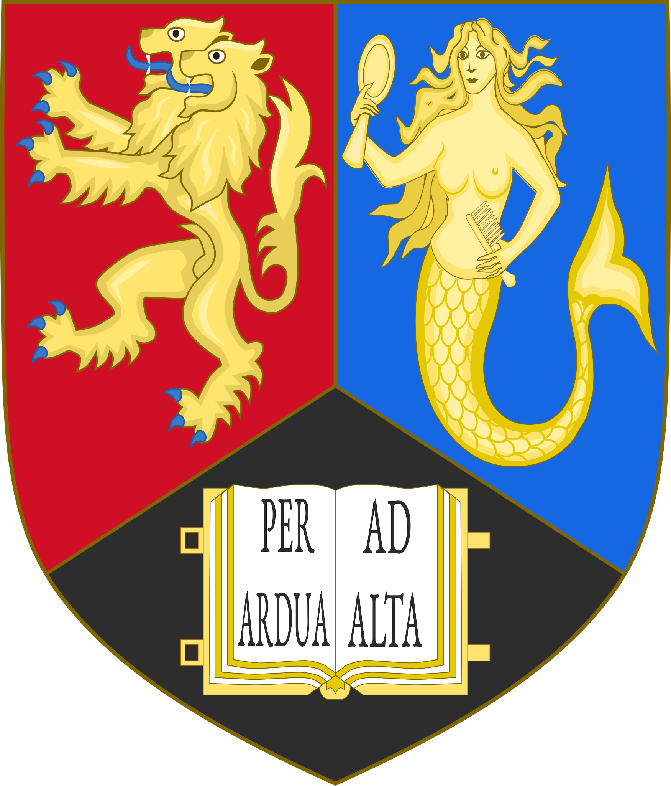

---
hide:
- navigation
- toc
---

    
    

        <h1>Welcome</h1>
        
Loose Lab

        <!-- <a href="#">Learn More</a> -->
    

 

# About

Our research focuses on the robust implementation of long-reads sequencing  in different area of applications. We push the limits of sequencing platform by addressing important technical goals, from successfully obtaining intact chromosomes sequence and trying to enrich rare and elusive transcripts.

Our current research goal is but not limited to:

<!-- - Sequencing of of ultra-long or "whales" reads 
- Nanopore adaptive sampling for DNA and RNA
- Implementation of real-time nanopore data analysis -->

- __:whale2:__{ .big }
    
    Sequencing of of ultra-long or "whales" reads

- __:simple-target:__{ .big }

    Nanopore adaptive sampling for DNA and RNA

- __:material-run:__{ .big }

    Implementation of real-time nanopore data analysis

## Featured Protocols and Tools

- { width="150" }
    
    __:material-dna: Protocol:__ FindingNemo in OneDay

    ---

    Cell to Flowcell in One Day

    [:simple-protocolsdotio: Protocol.io](https://www.protocols.io/view/findingnemo-in-oneday-ultra-long-ont-library-prepa-14egnzqzyg5d/v1)

- { width="375" }

    __:material-fish: Tool:__ ReadFish

    ---

    Flexible and fast adaptive sampling

    [:material-github: Github](https://github.com/LooseLab/readfish)

- { width="186.41" }

    __:material-bird: Tool:__ ROBIN

    ---

    Real time analysis of nanopore methylation data

    [:material-github: Github](https://github.com/LooseLab/ROBIN)

  [Find more protocols and tools](research.md){ .md-button }

# News and Release

- __ReadFish Multiplatform Update__

    Up until now ReadFish, and selective sequencing, have been limited to users with both a linux ...

    2020-12-02

    [:material-open-in-new: Read](blog/2020/12/02/readfish-multiplatform-update/)

# Collaborators

{ width="150" }

{ width="200" }

{ width="200" }

{ width="400" } 
    

<!-- </figure> -->
