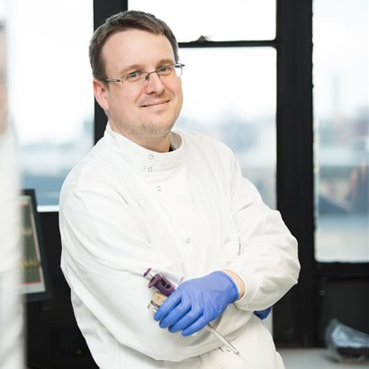

---
hide:
- navigation
- toc
---

# People

## Current Member

    
    

        <h1><b>Professor Matthew Loose</b></h1>
        
Group Lead

        <a href="https://www.nottingham.ac.uk/research/beacons-of-excellence/future-food/meet-the-team/matt-loose/index.aspx">Details</a>
    

    
    

        <h1><b>Dr. Inswasti Cahyani</b></h1>
        
Researcher

        <a href="#">Details</a>
    

    
    

        <h1><b>Rory Munro</b></h1>
        
Postgraduate Researcher

        <a href="https://github.com/Adoni5">Details</a>
    

    
    

        <h1><b>Simon Deacon</b></h1>
        
Postgraduate Researcher

        <a href="#">Details</a>
    

    
    

        <h1><b>Thomas Murray</b></h1>
        
Postgraduate Researcher

        <a href="#">Details</a>
    

    
    

        <h1><b>Satrio</b></h1>
        
Postgraduate Researcher

        <a href="https://github.com/satriobio">Details</a>
    

## Past Member
- [Alexander Payne](https://scholar.google.co.uk/citations?user=s3tPemIAAAAJ&hl=en)
- [Roberto Santos](#)
- [Lewis Gallagher](#)
- [Sam Holt](#)
- [Chris Alder](#)
- [Solomon Osei](#)
- [Teri Forey](#)